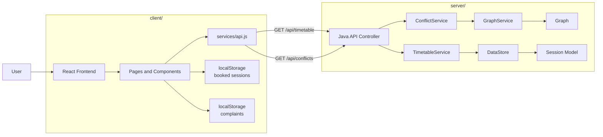
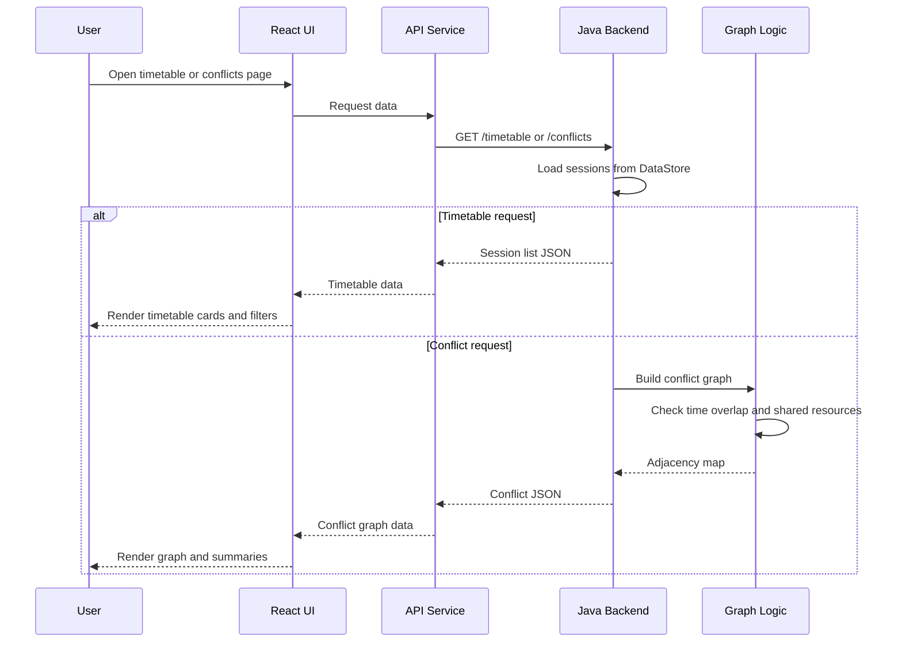
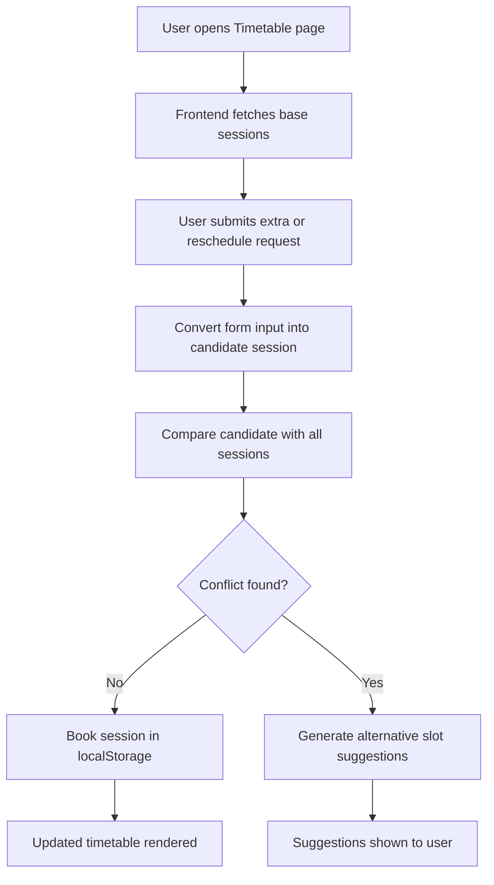
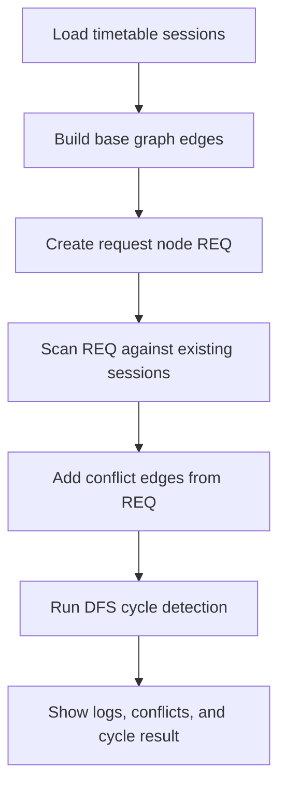
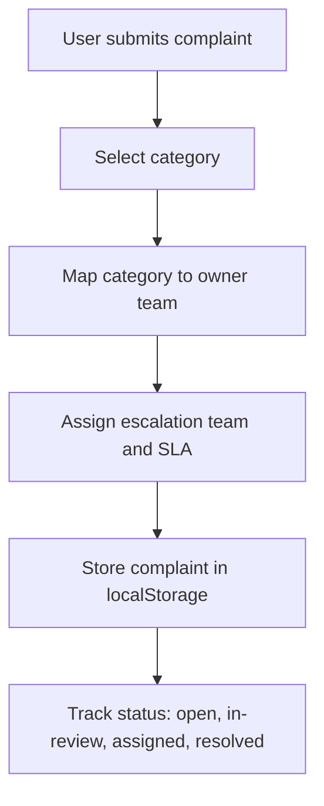

# CampusFlow

CampusFlow is a full-stack academic operations platform focused on timetable visibility, scheduling conflict detection, slot request simulation, and campus complaint routing. The project combines a React frontend with a lightweight Java backend and uses graph modeling to represent timetable clashes across faculty, rooms, sections, and lab batches.

## Overview

The system helps academic coordinators, faculty, and students understand how timetable decisions affect shared campus resources. It provides:

- A timetable dashboard for viewing sessions
- A request flow for extra lectures and rescheduling
- Graph-based conflict detection across overlapping sessions
- A visual graph lab to explain how nodes, edges, and cycles are formed
- A complaint center for routing campus infrastructure issues to the right team

## Key Features

- Timetable browser with search, day filters, and session-type filters
- Slot booking simulation with local persistence in the browser
- Automatic clash detection for faculty, room, section, and batch overlap
- Alternative slot suggestions when the requested slot is unavailable
- Conflict graph view generated from backend data
- Graph playground with request-node injection and DFS cycle detection trace
- Complaint submission workflow with owner team, escalation team, SLA, and status tracking

## Tech Stack

### Frontend

- React 19
- React Router
- Vite
- Tailwind CSS

### Backend

- Java
- NioFlow framework
- Manual JSON response generation

## Architecture



## Working Flow



## Conflict Detection Logic

CampusFlow models each session as a graph node. An undirected relationship exists between two sessions when:

- They occur on the same day
- Their time windows overlap
- At least one shared resource conflicts

The current backend checks these conflict conditions:

- Same faculty member
- Same room
- Same class and same section
- Same class and same batch

This logic is implemented in `server/graph/GraphService.java`.

## Project Structure

```text
DMGTProject/
|-- client/
|   |-- src/
|   |   |-- components/
|   |   |-- pages/
|   |   `-- services/
|   |-- public/
|   `-- package.json
|-- server/
|   |-- controller/
|   |-- data/
|   |-- graph/
|   |-- model/
|   |-- service/
|   |-- lib/
|   |-- App.java
|   `-- run.ps1
`-- README.md
```

## Main Modules

### Frontend Modules

- `Home`: landing page and feature entry points
- `Timetable`: displays sessions, filters data, and processes slot requests
- `Conflicts`: visualizes backend-generated conflict relationships
- `GraphPlayground`: demonstrates graph construction and cycle detection
- `Complaints`: manages complaint creation, routing, and status updates
- `About`: explains project intent and future production direction

### Backend Modules

- `App.java`: starts the NioFlow server on port `8080`
- `ApiController`: exposes `/timetable` and `/conflicts`
- `TimetableService`: returns session data from the data layer
- `ConflictService`: builds the conflict graph for current sessions
- `DataStore`: provides in-memory sample timetable data
- `GraphService`: implements overlap and conflict rules
- `Graph`: stores adjacency lists for session conflicts
- `Session`: core timetable entity

## API Endpoints

### `GET /`

Health response:

```text
Nioflow is running !
```

### `GET /timetable`

Returns an array of timetable sessions.

Example response:

```json
[
  {
    "id": "1",
    "subjectCode": "CS101",
    "courseCode": "CS101",
    "subjectName": "Operating systems",
    "faculty": "Hitesh chhikniwala",
    "room": "Room 305",
    "className": "CSE",
    "sessionType": "lecture",
    "section": "A",
    "batch": "",
    "day": "Mon",
    "startTime": "09:10",
    "endTime": "10:00",
    "time": "Mon 09:10-10:00"
  }
]
```

### `GET /conflicts`

Returns a graph adjacency map keyed by session id.

Example response:

```json
{
  "1": ["4", "5"],
  "4": ["1"]
}
```

## Frontend Feature Workflow



## Graph Lab Workflow



## Complaint Routing Workflow



## How To Run

### Prerequisites

- Node.js and npm
- Java JDK with `javac`
- PowerShell on Windows

### 1. Start the backend

From the project root:

```powershell
Set-Location .\server
.\run.ps1
```

The backend starts on `http://localhost:8080`.

### 2. Start the frontend

Open another terminal:

```powershell
Set-Location .\client
npm install
npm run dev
```

The frontend runs through Vite. During development, requests to `/api/*` are proxied to `http://localhost:8080`.

## Example User Journeys

### Timetable and Slot Request

1. Open the timetable page
2. Review current sessions and filters
3. Submit an extra lecture or reschedule request
4. System checks for room, faculty, section, and batch conflicts
5. If free, the slot is booked locally
6. If blocked, alternative slots are suggested

### Conflict Visualization

1. Open the conflicts page
2. Frontend requests the backend conflict graph
3. Backend builds adjacency relationships from session overlap rules
4. Frontend renders graph nodes and conflict summaries

### Complaint Management

1. Submit a complaint with category, location, and severity
2. System assigns owner team and escalation path
3. Complaint is stored in browser state
4. Status can be updated through its resolution lifecycle

## Current Data and Persistence Model

- Timetable session seed data currently comes from `server/data/DataStore.java`
- Booked timetable requests are stored in browser `localStorage`
- Complaints are stored in browser `localStorage`
- The current version is suitable for demonstration, academic presentation, and algorithm explanation

## Limitations

- No database integration yet
- No authentication or role-based access control
- No backend persistence for requests or complaints
- No POST endpoints for timetable changes or complaint creation
- Conflict data is based on in-memory session seed data
- JSON is manually constructed in the backend rather than serialized through a library

## Future Improvements

- Add a database for timetable, booking, and complaint persistence
- Expose POST and PUT APIs for booking and complaint workflows
- Add user roles for admin, faculty, student, and operations staff
- Add notification workflows for escalations and approvals
- Add graph coloring or optimization algorithms for automated slot allocation
- Add analytics dashboards for utilization, conflict density, and SLA compliance

## Academic Value

This project demonstrates practical use of:

- Graph representation using adjacency lists
- Resource conflict detection based on interval overlap
- DFS-based cycle detection
- Full-stack integration between UI and backend services
- Applied campus scheduling and operations modeling

## Conclusion

CampusFlow is more than a timetable viewer. It is a graph-aware academic operations prototype that connects scheduling intelligence, conflict explainability, and operational complaint routing in one interface. The current implementation is well suited for demonstrations, coursework, and future extension into a production-ready campus platform.
