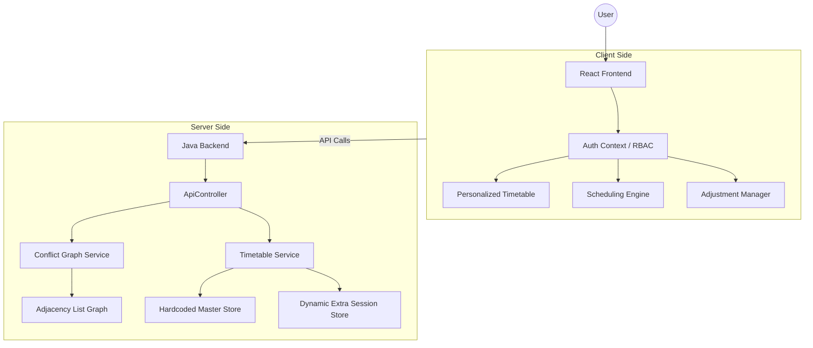
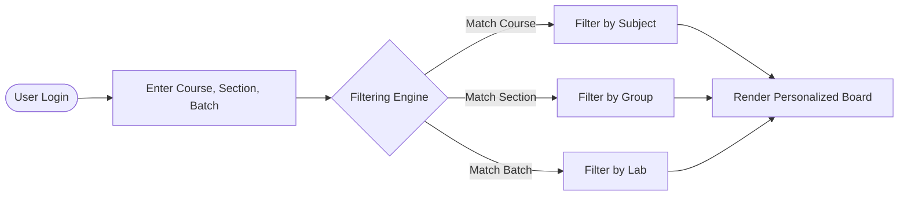
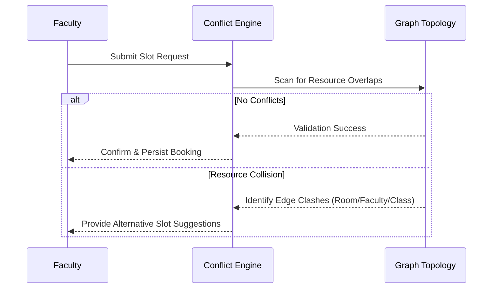

# CampusFlow: Academic Operations Intelligence

CampusFlow is an enterprise-grade academic operations platform designed for timetable optimization, scheduling conflict diagnostics, and campus infrastructure management. The system utilizes graph theory to model relationships between faculty, rooms, and student batches, ensuring a collision-free academic environment.

## Executive Summary

The platform provides a unified interface for three core academic stakeholders:

1. **Academic Coordinators**: Utilize the Diagnostic Audit Center for topological resource mapping and conflict resolution.
2. **Faculty**: Manage session scheduling with real-time clash detection, administrative overrides, and persistent adjustment tracking.
3. **Students**: Access personalized timetable boards filtered by course, year, section, and laboratory batch.

## Core Capabilities

### Role Based Access Control (RBAC)
The system implements a session-based authentication model separating administrative scheduling authority from student read-only personalized views.

- **Faculty Role**: Full authority to arrange extra lectures, perform administrative overrides, and manage the campus complaint lifecycle.
- **Student Role**: Personalized dashboard experience centered on the student's specific academic profile: Degree, Course (e.g., CSE, ICT), Year, Section, and Lab Batch.

### Persistent Scheduling System
Unlike traditional static timetables, CampusFlow allows for dynamic adjustments that persist across the entire campus ecosystem.
- **Server-Side Adjustments**: Extra lectures and reschedules are stored in a centralized `ExtraSessionStore` on the backend, ensuring consistency between faculty and student views.
- **Adjustment Manager**: Faculty have a dedicated dashboard in the navbar to track, manage, and manually cancel their scheduled adjustments.
- **Automated Lifecycle**: Temporary adjustments are automatically cleaned up after their scheduled period, keeping the interface focused and relevant.

### Diagnostic Audit Center
A network-level visualization tool that maps scheduling requests as nodes in an undirected graph. Conflicts are represented as edges when sessions overlap in time or share restricted resources.

### Campus Operations Hub
A reporting and tracking system for infrastructure maintenance. It features automated routing based on issue category, Service Level Agreement (SLA) tracking, and escalation path management.

## Architecture



## Stakeholder Workflows

### Student Personalization Engine
Students provide their academic profile during authentication. The system then applies a multi-dimensional filtering algorithm to the global master schedule.



### Scheduling & Conflict Trace
When a faculty member requests a new session, the engine performs a deep trace against the existing graph topology.



## Conflict Detection Parameters

The system identifies a conflict between two sessions if they occur on the same day, have overlapping time windows, and meet any of the following criteria:

- **Faculty Level**: The same instructor is assigned to concurrent sessions.
- **Venue Level**: The same room or laboratory is booked for simultaneous use.
- **Group Level**: The same student section or specific lab batch is required in two locations at once.

## Technical Implementation

### Frontend
- **Framework**: React 19 with Vite for high-performance rendering.
- **Styling**: Vanilla CSS utilizing a glassmorphism design system for a premium aesthetic.
- **State Management**: Context API for authentication and RBAC.
- **Networking**: Asynchronous fetch architecture with silent background refreshes for real-time schedule synchronization.

### Backend
- **Language**: Java.
- **Web Framework**: NioFlow (Lightweight NIO-based server).
- **Data Model**: Adjacency list representation for conflict relationships and a dual-store architecture for master and dynamic sessions.

## Project Team & Contributions

| Member | Major Contributions |
| :--- | :--- |
| **Jhanvi Patel** | **Backend Lead**: Architecture design, API development, NioFlow implementation, persistent storage logic, and RBAC implementation. |
| **Priya Modi** | **Frontend Lead**: UI/UX design system, Notification engine, Real-time schedule integration |
| **Darshi Prajapati** | **Database & Documentation**: Master data collection, Data insertion logistics, and Presentation (PPT) design. |
| **Jayraj Chauhan**| **Data Engineering**: Comprehensive study of academic schedules, data collection, and master data insertion. |

## Getting Started

### Backend Setup
Execute the following commands from the root directory to initiate the Java server:
```powershell
Set-Location .\server
.\run.ps1
```
The server will initialize on `http://localhost:8080`.

### Frontend Setup
Initiate the development server:
```powershell
Set-Location .\client
npm install
npm run dev
```
The application will be accessible via the localized Vite proxy.

## Project Vision

CampusFlow transitions traditional timetable management from a static viewing experience to a dynamic, graph-aware decision platform. By centralizing conflict intelligence and infrastructure reporting, the platform ensures that academic operations are both visible and optimized across the entire campus ecosystem.
